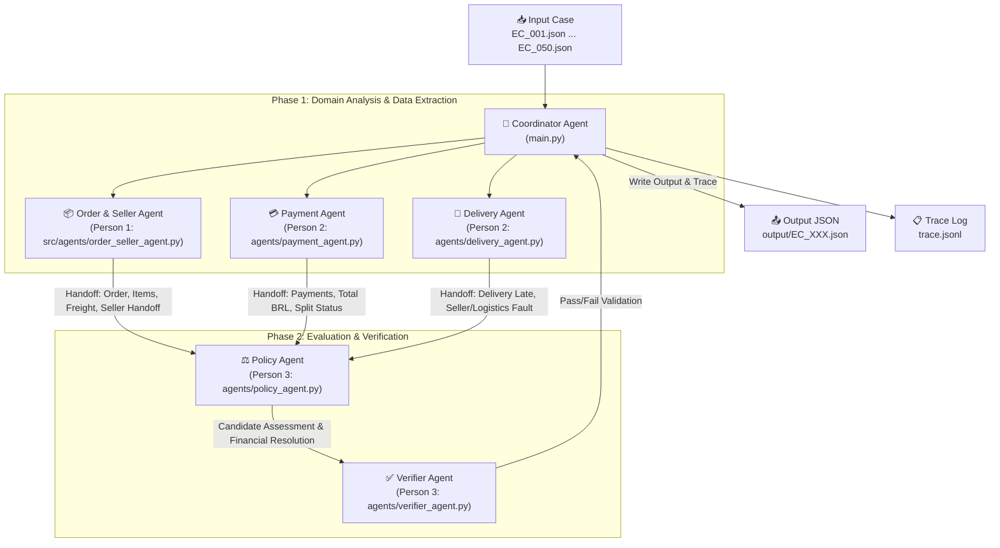

# Architecture Document — Multi-Agent E-commerce Dispute Resolution

## 1. Tổng quan Kiến trúc System (Multi-Agent System)

Hệ thống được thiết kế theo mô hình **Multi-Agent Collaborative Pipeline** với các vai trò phân định rõ ràng (Separation of Concerns). Mỗi Agent đảm nhận phân tích một miền dữ liệu (Domain) chuyên biệt, sau đó Handoff kết quả cho Agent điều phối (Coordinator Agent) và Agent chính sách (Policy Agent) để ra quyết định và kiểm chứng.



---

## 2. Bảng Phân Vai & Quyền Truy Cập Dữ Liệu (Agent Roles & Permissions)

| Agent Name | Thành viên | Vai trò & Trách nhiệm chính | Quyền truy cập Dữ liệu (Data Scope) |
|---|---|---|---|
| **Coordinator Agent** | Người 4 | Điều phối luồng pipeline, nạp case input, thu thập trace, ghi file output | `input/*.json`, `output/*.json`, `trace.jsonl`, `metadata.json` |
| **Order & Seller Agent** | Người 1 | Tra cứu thông tin đơn hàng, danh sách mặt hàng (items), người bán (sellers), kiểm tra mốc bàn giao seller (`shipping_limit_date`) | `olist_orders_dataset.csv`, `olist_order_items_dataset.csv`, `olist_sellers_dataset.csv` |
| **Payment Agent** | Người 2 | Tính tổng tiền thanh toán, kiểm tra nhiều dòng thanh toán (split payment) hợp lệ trong sai số ±0.10 BRL | `olist_order_payments_dataset.csv` |
| **Delivery Agent** | Người 3 (hỗ trợ N2) | So sánh thời điểm giao hàng thực tế vs dự kiến, phân loại trách nhiệm giao trễ thuộc Seller hay Logistics Provider | `olist_orders_dataset.csv`, `olist_order_items_dataset.csv` |
| **Policy Agent** | Người 3 | Khớp các quy tắc nghiệp vụ theo bảng ưu tiên `EC_POLICY_V1`, tính khoản hoàn tiền và đề xuất action | Handoff payloads từ Order/Seller Agent, Payment Agent, Delivery Agent |
| **Verifier Agent** | Người 3 | Kiểm tra schema, enum, giới hạn entity/evidence/action, và kiểm chứng evidence ID tồn tại thực tế | Output Candidate từ Policy Agent + Handoff payloads từ các Agents |

---

## 3. Luồng Handoff Dữ liệu (Handoff Protocol & Schemas)

### 3.1 Order & Seller Agent Handoff (`os_handoff`)
```json
{
  "order": { "order_id": "...", "order_status": "delivered", ... },
  "items": [ { "order_item_id": 1, "seller_id": "...", "price": 100.0, "freight_value": 15.0, "shipping_limit_date": "..." } ],
  "seller_handoff_late": true,
  "violating_seller_ids": [ "<seller_id>" ],
  "item_total_brl": 100.0,
  "freight_total_brl": 15.0,
  "evidence_ids": [ "order:<order_id>", "item:<order_id>:1", "seller:<seller_id>" ]
}
```

### 3.2 Payment Agent Handoff (`pay_handoff`)
```json
{
  "payment_rows": [ { "payment_sequential": 1, "payment_type": "credit_card", "payment_value": 115.0 } ],
  "payment_count": 1,
  "payment_total_brl": 115.0,
  "has_valid_split_payment": false,
  "payment_ids": [ "<order_id>:1" ],
  "evidence_ids": [ "payment:<order_id>:1" ]
}
```

### 3.3 Delivery Agent Handoff (`del_handoff`)
```json
{
  "delivery_late": true,
  "seller_late": true,
  "logistics_late": false,
  "delivery_within_estimate": false,
  "violating_seller_ids": [ "<seller_id>" ],
  "timestamps": { "delivered_customer": "...", "estimated_delivery": "...", "delivered_carrier": "..." }
}
```

---

## 4. Quy trình Đảm bảo Chất lượng & Verifier Agent (Verification Checks)

Verifier Agent thực hiện 6 nhóm kiểm tra trước khi ghi nhận file output:
1. **Schema Validation**: Đảm bảo đầy đủ các key top-level và nested object.
2. **Enum & Bound Validation**: `primary_issue` thuộc 6 loại quy định, `confidence` trong `[0, 1]`, `currency = "BRL"`.
3. **Limit Enforcement**: `order_ids` (<=5), `item_ids` (<=5), `seller_ids` (<=5), `payment_ids` (<=5), `evidence_ids` (<=10), `ranked_causes` (<=3), `responsible_parties` (<=3), `resolution_actions` (<=5).
4. **Evidence Anti-Hallucination**: Kiểm tra mọi Evidence ID nộp lên (ngoại trừ `policy:CODE`) phải tồn tại thực sự trong tập dữ liệu CSV thu thập từ Handoff.
5. **Consistency Checks**:
   - `canceled_order_paid` / `unavailable_order_paid` -> Refund = `payment_total_brl`, Party = `platform` / `OLIST_PLATFORM`.
   - `late_delivery_seller` / `late_delivery_logistics` -> Refund = `freight_total_brl`, Party = `seller` hoặc `logistics_provider`.
   - `valid_split_payment` / `unsupported_late_claim` -> Refund = `0.0`.
6. **Decimal Precision**: Toàn bộ giá trị tài chính bắt buộc làm tròn đúng 2 chữ số thập phân (`round(val, 2)`).
